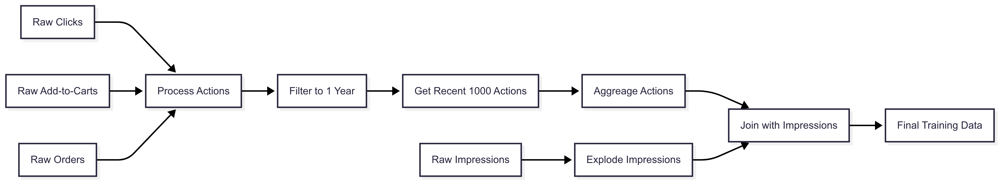

# PySpark Coding Challenge — Training Input Pipeline

## Overview
This project prepares training data for a transformer-based recommendation model from raw impressions and user actions (clicks, add-to-cart, previous orders).

The output contains one row per **impression item** with:
- `impression_item_id`
- `is_order`
- The last 1000 **historical actions** for that customer before the impression date (`action_items` and `action_types` arrays).

## Output Schema
| Column              | Type          | Description |
|---------------------|--------------|-------------|
| dt                  | string       | Impression day (partition key) |
| customer_id         | long         | Customer id |
| ranking_id          | string       | Carousel ranking id |
| impression_item_id  | long         | Item id in impression |
| is_order            | int          | 1 if ordered, else 0 |
| action_items             | array<int>   | Last 1000 item_ids, newest first, 0 padded |
| action_types        | array<int>   | Matching action types: 1=click, 2=add_to_cart, 3=order, 0=pad |

## Pipeline Architecture

### Data Flow

### Pipeline Steps
1. **Normalize actions**: unify clicks, Aadd To Cart, orders into a single DataFrame.
2. **Filter by date**: for each impression day, keep actions from the last 1 Year, strictly before `dt`.
3. **Rank & truncate**: assign row numbers per customer, keep top 1000 most recent.
4. **Aggregate**: collect ordered lists of item_ids and action_types, pad to fixed length.
5. **Join with impressions**: explode impressions to one row per item and attach actions.

## Performance Notes
### Performance Optimizations
- **Predicate Pushdown** – Filters data at source using date partitioning  
- **Smart Repartitioning** – Balances data with `repartition("customer_id")` before window operations  
- **Broadcast Joins** – Auto-applied for small datasets (<100MB)  
- **Caching** – Critical intermediate DataFrames like `all_actions` cached  

### Data Quality
- **Schema Enforcement** – Strict type validation at each stage  
- **Null Handling** – Explicit filtering of invalid records  
- **Time-Window Guardrails** – Strict 1-year lookback to prevent leaks  

### Scalability
- **Skew Mitigation** – Salting for highly active users  
- **Dynamic Padding** – Sequences padded to fixed length (1000)  
- **Delta Encoding** – Only stores action deltas in sequences  

### Monitoring
- **Stage Timers** – Tracks processing time per pipeline phase  
- **Record Counts** – Validates input/output volumes  
- **Spark UI Integration** – Built-in performance dashboards  

### Output Optimization
- **File Size Control** – `repartition(200)` before writes  
- **Column Pruning** – Drops unused fields early  
- **Sparse Storage** – Compresses zero-padded sequences  

## Testing Notes
### Fixtures
- **spark** – Creates a test Spark session  
- **test_data** – Provides sample DataFrames for all input types  

### Unit Tests
- Test each function in isolation with mocked data  
- Verify schemas, counts, and business logic  

### Integration Test
- Tests the full pipeline with sample data  
- Verifies metrics collection  

### Edge Case Tests
- Empty inputs  
- Duplicate actions

### Performance Test
- Measures execution time  
- Can be enabled for manual performance testing  

### Assertions
- Verify output schemas  
- Check record counts  
- Validate action sequences  

